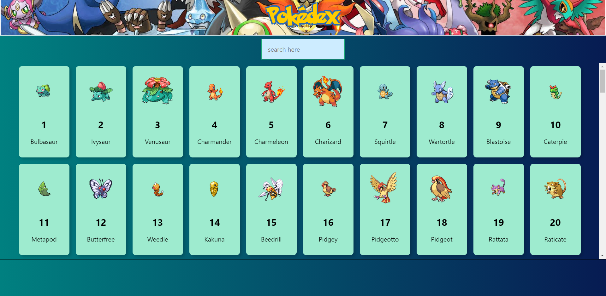

# Pokedex Web Application
This is a simple react web application which utilizes the [***pokeapi***](https://pokeapi.co/)



## Table of Contents
* [Demo](#demo)
* [Features](#features)
* [Library Version](#library-version)
* [Installation](#installation)
* [Note](#note)
## Demo 
Live demo here --> [Demo](https://thanathip-sukkulcharoen.github.io/Pokedex/)
## Features
* Simple Pokedex from Pokemon game.
* Allow searching pokemon by entering pokemon's name.
## Library Version
* [React](https://reactjs.org/) version 17.0.1
* [Tachyons](https://tachyons.io/) version 4.12.0

## Installation
Follow the instructions below
1. Git clone this project
2. If you haven't installed the Node.js, please install it first. [Node.js](https://nodejs.org/en/download/)
3. Open command line on project directory
4. Run these commands below

```bash
# Install dependencies
$ npm install

# Run the app
$ npm start
```
After the server compiled successfully. Open [http://localhost:3000/Pokedex](http://localhost:3000/Pokedex)

## Note 
This application uses local images instead of API.
The sprites can be downloaded here : [PokeAPI/sprites](https://github.com/PokeAPI/sprites#sprites)
